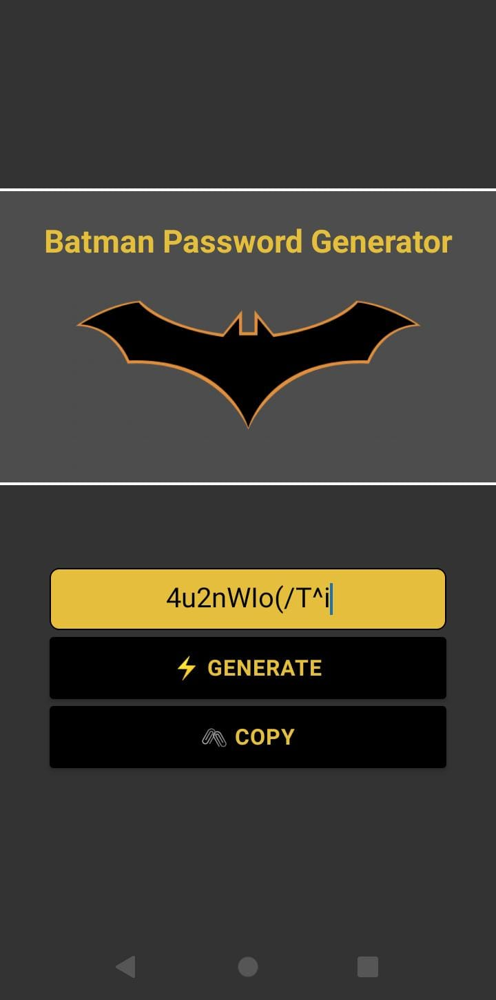

# 🦇 Batman Password Generator

Aplicativo desenvolvido em **React Native** com **Expo** e **TypeScript**, inspirado na temática do Batman.  
O app gera senhas seguras de **12 caracteres aleatórios** e permite que o usuário copie facilmente para usar onde quiser.  

## 🚀 Tecnologias
- [React Native](https://reactnative.dev/)  
- [Expo](https://expo.dev/)  
- [TypeScript](https://www.typescriptlang.org/)  

## 📱 Funcionalidades
- Geração de senha aleatória com 12 caracteres  
- Copiar senha gerada para a área de transferência  
- Interface simples e temática do Batman 🦇  

## ▶️ Como executar
1. Clone este repositório:
```bash
   git clone https://github.com/seu-usuario/seu-repositorio.git
```

2. Instale as dependências:
```bash
   npm install
```

   ou

```bash
   yarn install
```
3. Inicie o projeto com Expo:

```bash
   npm run start
```

## 📸 Preview

<div align="center">

</div>

---

Feito com 🖤 e inspirado no Batman 🦇